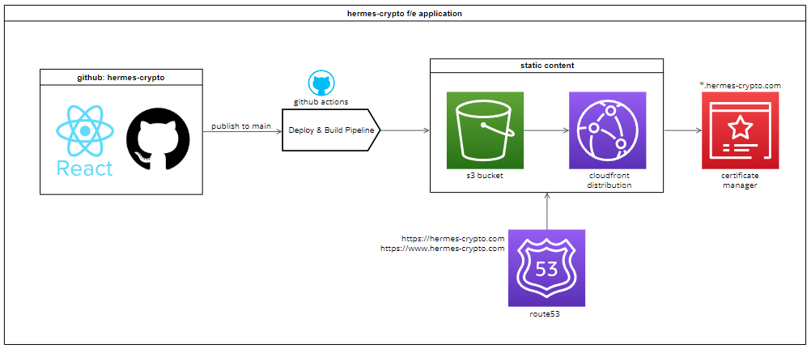

<h1 align="center"> hermes-crypto</h1>
<p align="center"></p>

Hermes (called Mercury in Roman mythology) was considered the messenger of the Olympic gods. He possesses the ability to influence outcomes and tip the scales in favor of those who seek his benevolence. As the god of luck, he brings both fortune and misfortune to those who dare to ask.

`hermes-crypto` is a fun page where you can ponder if the price of your coin will go up or down; place your bets, and see if the gods will be in your favour!

## This REPO

This repo contains the F/E for `hermes-crypto` as a whole. This includes all components, visual library and actual web-app itself.

## Status

[](https://github.com/svbygoibear/hermes-crypto/actions/workflows/s3-pipeline.yml) [](https://github.com/svbygoibear/hermes-crypto/actions/workflows/test-suite.yml) [](https://66b7998d30a1b8b8fa5d2380-qsxkxbzjkw.chromatic.com/)

## What makes me tick?

Under the hood, I am powered by;

-   [Vite](https://vitejs.dev/): Why Vite? It is lightweight, fast and has a ton of plugins. There are many good options available, but Vite made sense to get a project up and running quickly without applying the constraints of a framework.
-   [React](https://react.dev/): In 2024 it would be crazy to start up a new project and not use something like React/Vue/Angular when working in the JS ecosystem - unless you had a specific requirement to go that route.
-   [Typescript](https://www.typescriptlang.org/): A typed language is a powerful language. Not because it makes you fast, but because it helps you define a contract in your code. This leads to better tooling, less type-related errors and overall more confidence in your work.
-   [Storybook](https://storybook.js.org/): This is the perfect addition to any frontend to develop components in isolation, as well as testing and documentation.
-   [Vitest](https://vitest.dev/): To compliment Storybook, Vitest is a Vite-native testing framework that re-uses all of Vite's config and plugins to ensure consistency! Want to add Jest later on? No problem.
-   [React Router](https://reactrouter.com): For routing between pages > react router makes this possible.

## Installation

### Software

To properly run this project, assuming you already have git installed, you will also need to ensure that you have the following installed on your machine:

-   [`node.js`](https://nodejs.org/en): Lowest possible version compatible with this project is `v18.14.0`. The current LTS is however recommended.
-   [`npm`](https://www.npmjs.com/): For info on installation, go [here](https://docs.npmjs.com/downloading-and-installing-node-js-and-npm). Minimum version required is `9.3.1`.
-   [`playwright`](https://playwright.dev/): If you want to run tests via storybook - you will have to install playwright. Simply run `npx install playwright` in the project terminal.

### Running

First to get things started, you have to install all the dependencies for this project by running the following in terminal on this project root:

```bash
npm install
```

Next, start up the project! If you are running this locally, fire it off in dev mode. This will give you access to additional debugging as well as an uncompressed version of this project.

```bash
npm run dev
```

Finally, you will need to create an `.env.local` file at the root of this repo. Follow the example at the base of this repo for which variables to configure.

And that is it!

### Issues

There is a known issue with [`storybook`](https://storybook.js.org/) when running it, it does not cause any issues but it has been noted here: https://github.com/storybookjs/storybook/issues/28567 

This only causes an output display warning but does not impact functionality.

## Architecture
In this repo you are simply looking at the code and the underlying architecture that fuels it, but for the deployed solution, we have the following configured:


## A Deep Dive

This readme is to get you started, up and running and give some light background context. If you want a little more information, feel free to check out:

-   [What am I doing here?](./docs/goal.md): Want more background on the objectives of this app? This is the place.
-   [Technical Decisions](./docs/choices.md): This is a demo, and therefore some decisions were made to accommodate the scope of this project. This includes considerations, assumptions, etc.

## Contributing

Pull requests are welcome. For major changes, please open an issue first to discuss what you would like to change.

Please make sure to update tests as appropriate; changes to components or addition of components will require adding those changes/new components to `storybook` as well.

## License

[MIT](https://choosealicense.com/licenses/mit/)